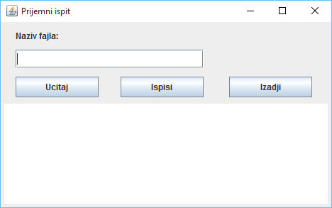

# Zadatak 1

**NAPOMENA: PO ZAVRŠETKU ZADATKA OBAVEZNO TESTIRATI REŠENJE POZIVANJEM AUTOMATIZOVANIH TESTOVA (desnim tasterom na naziv projekta, Run as - Java Application - PokreniTestove)**

Napraviti javnu klasu **PrijemniException** u paketu **prijemni.izuzeci** kao neproveravani izuzetak i koja ima:
- Javni **konstruktor** koji kao parametar prima poruku greške i poziva odgovarajući konstruktor nadklase prosleđujući mu parametar.

Napraviti javnu klasu **PrijemniIspit** u paketu **prijemni** koja može da bude serijalizovana i ima:
- Privatni atribut **nazivUstanove**.
- Privatni atribut **godinaUpisa** koji predstavlja godinu upisa na koju se odnose podaci (npr. 2018).
- privatni atribut **brojMesta** koji predstvlja broj mesta za upis na fakultet.
- Privatni atribut **brojPrijavljenih** koji predstavlja broj prijavljenih kandidata za prijemni ispit.
- Odgovarajuće javne **get i set metode** za ove atribute. Nedozvoljene vrednosti za naziv su null i svaki String kraći od pet znakova, a svi ostali atributi moraju biti nula ili veći od nule. U slučaju unosa nedozvoljenih vrednosti, baciti izuzetak klase **PrijemniException** sa odgovarajućom porukom.
- Redefinisanu metodu **toString** klase Object koja vraća String sa svim podacima o prijemnom ispitu ali je potrebno izračunati i u taj String ubaciti i podatak o relativnom odnosu broja prijavljenih i broja mesta (podeliti ta dva).
- Redefinisanu **equals** metodu klase Object. Metoda prvo proverava da li je uneti objekat klase PrijemniIspit, pa ako nije vraca false. Metoda vraća true ako su vrednosti svih atributa jednaki vrednostima odgovarajućih atributa unetog prijemnog ispita, a inače false.

Napraviti javnu klasu **OrganizacijaPrijemnogIspita** u paketu **prijemni** koja ima:
- Privatni atribut **ustanove** koji predstavlja listu objekata klase **PrijemniIspit**. Odmah inicijalizovati listu.
- Javnu metodu **ucitajIzFajlaUListu** koja ne vraća ništa, a kao parametar dobija naziv fajla iz kojeg je potrebno deserijalizovati podatke o prijemnom ispitu i uneti ih u listu. Unos u listu se vrši samo za one ustanove (iz fajla) kod kojih je broj prijavljenih veći od nule. Ukoliko dodje do greške, baciti izuzetak klase **PrijemniException** sa odgovarajućom porukom.
- Javnu metodu **vratiUspesnePrijemneIspite** koja vraca listu naziva ustanova koje su 2018. godine imale veći broj prijavljenih nego 2017. godine.

Napraviti vizuelnu klasu **PrijemniGUI**u paketu **prijemni.gui** koja izgleda kao na slici. Naslov prozora bi trebalo da bude "Prijemni ispit", a centralni deo ekrana bi trebalo da sadrži editor za tekst. Kada se promeni dimenzija forme, trebalo bi da se ovaj centralni deo poveća/smanji, a da ostale komponente ostanu na istom mestu.
- Klasa **PrijemniGUI** bi trebalo da sadrži privatni atribut **organizacijaPrijemnog** koji predstavlja objekat klase **OrganizacijaPrijemnogIspita**. Odmah inicijalizovati objekat.
- Kada se pritisne dugme "Izadji", prekida se izvršavanje programa.
- Kada se pritisne dugme "Ucitaj", iz polja za naziv fajla se preuzima tekst koji sadrži naziv fajla i poziva se odgovarajuća metoda atributa **organizacijaPrijemnog** kojom se deserijalizuju podaci o prijemnim ispitima. U slučaju greške, ispitati poruku greške u JOptionPane dijalogu.
- Kada se pritisne dugme "Ispisi", ispisuje se izveštaj u editoru koji sadrži samo nazive ustanova koje su 2018. godine imali veći broj prijavljenih nego 2017. godine (poziva se odgovarajuća metoda atributa **organizacijaPrijemnog**). U slučaju da nema ustanova koje ispunjavaju ovaj uslov, ispisati poruku o tome u JOptionPane dijalogu.

# Zadatak 2 (ispravka koda)

**NAPOMENA: PO ZAVRŠETKU ZADATKA OBAVEZNO TESTIRATI REŠENJE POZIVANJEM AUTOMATIZOVANIH TESTOVA (desnim tasterom na naziv projekta, Run as - Java Application - PokreniTestove)**

U produžetku teksta je dat kod klase sa metodom koja bi trebalo da u tekstualni fajl "brojevi2.txt" upiše sve proste brojeve u rasponu od 1 do 100. Broj je prost ako je deljiv isključivo brojem 1 i sobom. Konkretno, u fajlu bi trebalo da se nađu brojevi: 1, 2, 3, 5, 7, 11, 13, 17, 19, ..... i 97.

Dati kod se kompajlira, ali ne radi to šta treba. Napraviti javnu klasu **UpisivanjeUTXTFajl2** u paketu **ispravka_koda**, prekucati u nju kod koji je dat i uz minimalne izmene ga ispraviti tako da funkcioniše kako treba. Napraviti test klasu i, koristeći njenu **main** metodu, pozvati metodu **upisiProsteBrojeve()** i proveriti njen rad.
	
	import java.io.FileWriter;
	import java.io.IOException;
	import java.io.PrintWriter;
	
	public class UpisivanjeUTXTFajl2 {
	
		public static void upisiProsteBrojeve() {
			try {
				PrintWriter out = new PrintWriter(new FileWriter("brojevi2.txt"));
	
				for (int i = 1; i <= 100; i++) {
					int brojDelilaca = 0;
					for (int j = i + 1; j < i; j++)
						if (j % i == 0)
							brojDelilaca++;
	
					if (brojDelilaca == 0)
						out.println(i);
				}
			} catch (IOException e) {
				e.printStackTrace();
			}
		}
	}
